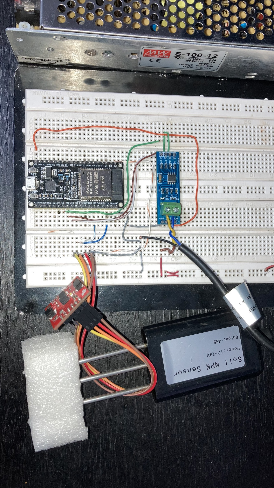
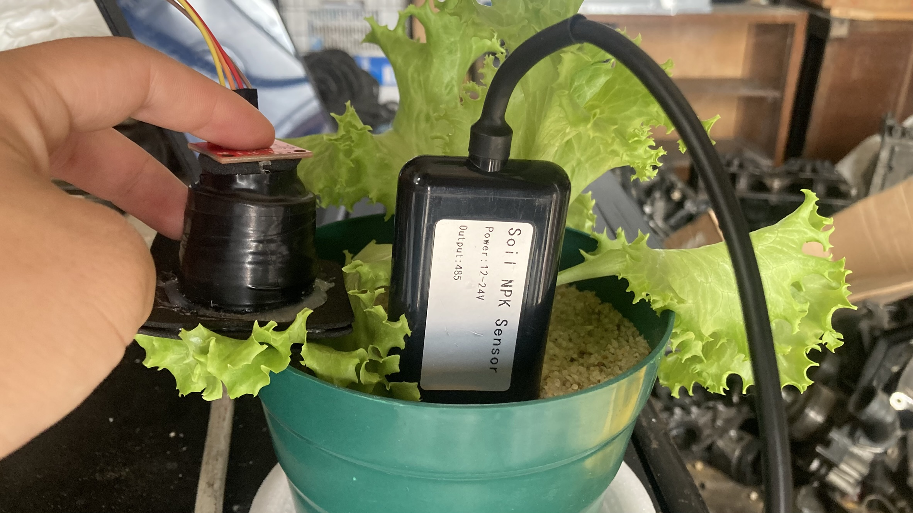

# Early NPK Deficit Predictor: End-to-End IoT and Edge AI Platform

This repository contains the hardware architecture, firmware, and machine learning pipeline developed for the early detection of macronutrient deficiencies (Nitrogen, Phosphorus, and Potassium) in short-cycle crops (*Lactuca sativa* var. *Black Simpson*). The platform integrates substrate-level telemetry via Modbus RTU, visible-range spectrometry at the edge, and a multi-class predictive pipeline.

---

## 1. System Architecture and Data Flow

The platform is organized into two asynchronously coupled subsystems: the acquisition and instrumentation layer (IoT) and the analytical predictive layer (Modeling).


### Data Flow Overview:
1. **IoT Layer:** The central microcontroller (ESP32) manages the synchronous acquisition of macro-environmental substrate variables via an industrial NPK probe connected over a differential bus, alongside foliar spectral signatures captured via a spectrometric sensor.
2. **Ingestion Interface:** Data structures are formatted locally for buffering or direct network transmission to centralized storage systems.
3. **Modeling Layer:** Raw telemetry vectors enter a sequential ETL pipeline for data cleaning, non-linear spectral reflectance index extraction, feature scaling, and statistical inference to classify the nutritional state of the crop.

---

## 2. Hardware Interfaces and Electrical Schematic

The power and instrumentation stages are engineered to isolate switching noise from the industrial power supply, protecting the digital and analog sensor reading stages.

> **[Placeholder]** The detailed electrical schematic in CAD/KiCad format is currently undergoing final export validation and will be positioned below.
> 
> 

### Interface Specifications:
* **Central Processing Unit:** ESP32 DevKitC utilizing integrated SRAM for intermediate telemetry frame buffering.
* **Spectral Sensor:** Adafruit AS7262 6-channel visible spectrum spectrometer, communicating via an I2C bus clocked at 400 kHz.
* **Substrate Probe:** Industrial NPK soil sensor operating on the RS485 protocol, requiring external voltage excitation and data line isolation.
* **Data Transceiver:** MAX485 module configured for differential RS485-to-TTL translation, routed directly to the ESP32 hardware UART.

---

## 3. Physical Implementation

The experimental setup transitioned from a breadboard-mounted prototype for continuity validation to a functional deployment within a controlled substrate greenhouse environment.

### Electronic Prototyping and Bench Testing
During this phase, a Mean Well S-100-12 switching power supply (12V, 8.5A) was implemented to drive the industrial NPK probe. A regulated 5V rail was derived to power the ESP32 logic bus and the MAX485 transceiver.



### Instrumentation in Controlled Crop Environment
To eliminate physical bias caused by external ambient light radiation (which introduces optical noise into the photodiode arrays), a custom sealed optical isolation chamber was engineered and fitted over the AS7262 sensor. This structural enclosure ensures that the captured spectral signatures reflect only the light wavelengths induced by the sensor's own onboard excitation LED interacting with the foliar morphology.



---

## 4. Predictive Modeling Results

The analytical core evaluates the incoming physical telemetry vectors to classify the crop into one of four distinct nutritional states: Potassium Deficit (-K), Nitrogen Deficit (-N), Phosphorus Deficit (-P), or Healthy (Control). 

The training script executes a stratified 5-fold cross-validation strategy using a Gradient Boosting (GB) framework to ensure robust generalization metrics and mitigate spatial overfitting. The evaluation pipeline output metrics are structured below.

### Stratified Cross-Validation Execution (5 Folds)

| Evaluation Phase | Accuracy | F1-Macro |
| :--- | :---: | :---: |
| Fold 1 | 0.7444 | 0.6968 |
| Fold 2 | 0.8778 | 0.8672 |
| Fold 3 | 0.8000 | 0.7745 |
| Fold 4 | 0.8372 | 0.8523 |
| Fold 5 | 0.8427 | 0.6567 |
| **Global Evaluation Summary (Mean)** | **0.8204 (+/- 0.0453)** | **0.7695 (+/- 0.0830)** |

### Evaluation Metrics by Target Class

| Class / Framework Metric | Precision | Recall | F1-Score | Support |
| :--- | :---: | :---: | :---: | :---: |
| **-K** | 0.87 | 0.88 | 0.88 | 101 |
| **-N** | 0.73 | 0.78 | 0.75 | 116 |
| **-P** | 0.85 | 0.75 | 0.80 | 106 |
| **Control** | 0.84 | 0.87 | 0.85 | 122 |
| **Accuracy** | | | 0.82 | 445 |
| **Macro Average** | 0.82 | 0.82 | 0.82 | 445 |
| **Weighted Average** | 0.82 | 0.82 | 0.82 | 445 |

### Technical Performance Analysis:
* **Model Generalization:** The Gradient Boosting classifier achieved a consolidated global accuracy of 82.04% (+/- 4.53%) and a mean F1-Macro score of 76.95% (+/- 8.30%). Variance across folds stabilizes past Fold 2, validating the model's capacity to handle physiological variations in substrate-grown mediums.
* **Class Specificity:** The model exhibits its highest discriminative power when isolating Potassium deficiencies (-K), yielding an F1-score of 0.88. The Control group demonstrates stable classification metrics (F1-score of 0.85, Recall of 0.87), minimizing false positives that could trigger unnecessary agricultural interventions.
* **Statistical Convergence Challenges:** Nitrogen deficiency (-N) exhibits a lower precision (0.73) despite a moderate recall (0.78). This reflects a known agrotechnological constraint: the spectral signature shifts characterizing early-stage chlorosis often overlap mathematically with early-stage phosphorus variance or minor hydration anomalies, presenting a tighter hyper-plane boundary for the ensemble trees.

---

## 5. Deployment Instructions

### Environment Setup
```bash
git clone https://github.com/munozr-juan/nutritional-npk-deficit-predictor.git
cd nutritional-npk-deficit-predictor/ml_pipeline
pip install -r requirements.txt
```

### Pipeline Execution
To replicate the cross-validation strategy or train the model using the raw telemetry dataset:
```bash
python scripts/train_pipeline.py
```

---

## Author
* **Juan Camilo Muñoz** - Electronic Engineer - Universidad de los Andes.